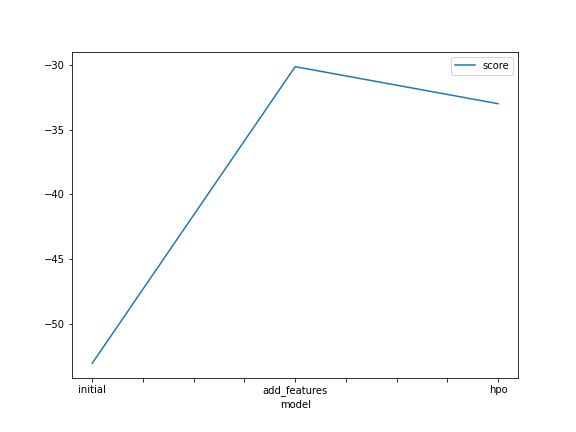
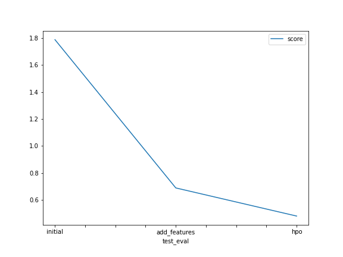

# Report: Predict Bike Sharing Demand with AutoGluon Solution
#### Hpone Aung Thet

## Initial Training
### What did you realize when you tried to submit your predictions? What changes were needed to the output of the predictor to submit your results?
When I submitted my first prediction, I realized it doesn't work really well in training scores. As I realized that kaggle doesn't accept values less than 0, I firstly checked if there are any negative count predicitons but there aren't and thus, I proceed to submit my results.

### What was the top ranked model that performed?
The top ranked model is WeightedEnsemble_L3 with the score of -53.062675

## Exploratory data analysis and feature creation
### What did the exploratory analysis find and how did you add additional features?
When I first plot the histograms, I noticed that some of them have normal distribution, some of them skewed to right but among them, datetime tables seems unnecessarily packed with data that can be further separated. Thus, I added 4 additional features, year, month, day and hour using datetime.dt.<year,month,day,hour>.

### How much better did your model preform after adding additional features and why do you think that is?
I'm surprised that the model performed a lot better from -53.062675 to -30.131712, nearly half the score improved. I believe the model have the ability to take in more information from the added features and thus, improving the prediction accuracy based on such information.

## Hyper parameter tuning
### How much better did your model preform after trying different hyper parameters?
It is somewhat surprising that during the ranking of the models, the score_val of the best model becomes worse than the prior model, from -30.131712 to -32.996066. However, interestingly enough, when it comes to kaggle score, the score was improved! From 0.68835 to 0.47966, the score improves about 20%. 

### If you were given more time with this dataset, where do you think you would spend more time?
I would tinker with the category values and also check the correlation between weather conditions and the count.

### Create a table with the models you ran, the hyperparameters modified, and the kaggle score.
|model|time_limit|num_trials|hyperparameters|score|
|--|--|--|--|--|
|initial|600|1|Default|1.78818|
|add_features|600|1|Default|0.68835|
|hpo|1200|6|XGB and GBM tuned|0.47966|

### Create a line plot showing the top model score for the three (or more) training runs during the project.

TODO: Replace the image below with your own.

### Create a line plot showing the top kaggle score for the three (or more) prediction submissions during the project.

TODO: Replace the image below with your own.

## Summary
I ran through the notebook twice as I was confused with the part "Create a table with the models you ran, the hyperparameters modified, and the kaggle score." On the first run, the kaggle score and model score of both added_features_submission and hpo_submission are nearly the same, with a smooth line descending on the graph. Those first scores can be seen on kaggle submission part of the notebook. However, on the second run, I added hyperparameters for XGB and GBM and suprisingly, I'm met with interesting results as explained above. Thus, I believe the model on the second run can perform better on test data and predictions.
